# Building Complex Tableau Dashboards with a Team — Cloud-Only Playbook

How to build a non-trivial Tableau dashboard with multiple developers working in parallel, using only **Tableau Cloud Web Authoring** (no Tableau Desktop), without the team overwriting each other's work or becoming single-developer-bottlenecked.

This is a reference for real-world enterprise conditions: many data sources, many scenarios, many stakeholders, a team of developers, strict governance, zero tolerance for "the dashboard broke because two people saved at once."

---

## Table of contents

- [Architecture at a glance](#architecture-at-a-glance)
- [The fundamental constraint](#the-fundamental-constraint)
- [What changes when you're Cloud-only](#what-changes-when-youre-cloud-only)
- [Core architecture](#core-architecture)
- [Part 1 — Cloud project governance](#part-1--cloud-project-governance-devstagingprod)
- [Part 2 — Decomposing the dashboard](#part-2--decomposing-the-dashboard)
- [Part 3 — Published data source as single source of truth](#part-3--published-data-source-as-single-source-of-truth)
- [Part 4 — Linking workbooks](#part-4--linking-workbooks-into-one-product)
- [Part 5 — Cloud-only workflow end to end](#part-5--cloud-only-workflow-end-to-end)
- [Part 6 — Production-grade automation](#part-6--production-grade-automation-scripts)
- [Part 7 — Python SDK toolkit for the team](#part-7--python-sdk-toolkit-for-the-team)
- [Part 8 — MCP: validation, review, verification](#part-8--mcp-validation-review-verification)
- [Part 9 — Local development workflow](#part-9--local-development-workflow-prototype-before-cloud)
- [Part 10 — AI-assisted creation: formulas, pipelines, visualizations](#part-10--ai-assisted-creation-formulas-pipelines-visualizations)
- [Part 11 — If you have Tableau Desktop available](#part-11--if-you-have-tableau-desktop-available)
- [Part 12 — Quality gates before production](#part-12--quality-gates-before-production)
- [Part 13 — Performance at scale](#part-13--performance-at-scale)
- [Part 14 — Licensing and cost](#part-14--licensing-and-cost)
- [Part 15 — When this pattern is wrong](#part-15--when-this-pattern-is-wrong)
- [Adoption plan](#adoption-plan--week-1)
- [Change log + references](#change-log)

---

## Architecture at a glance

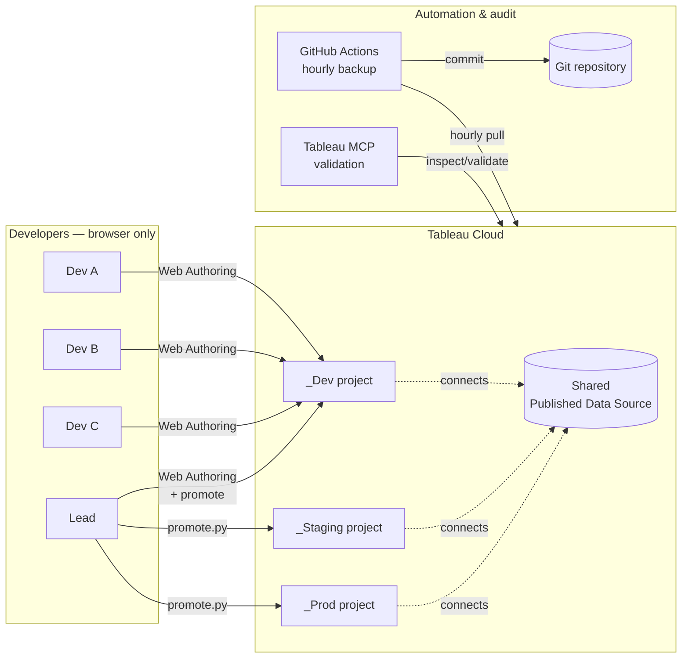

**Decision tree — is this the right pattern for your team?**

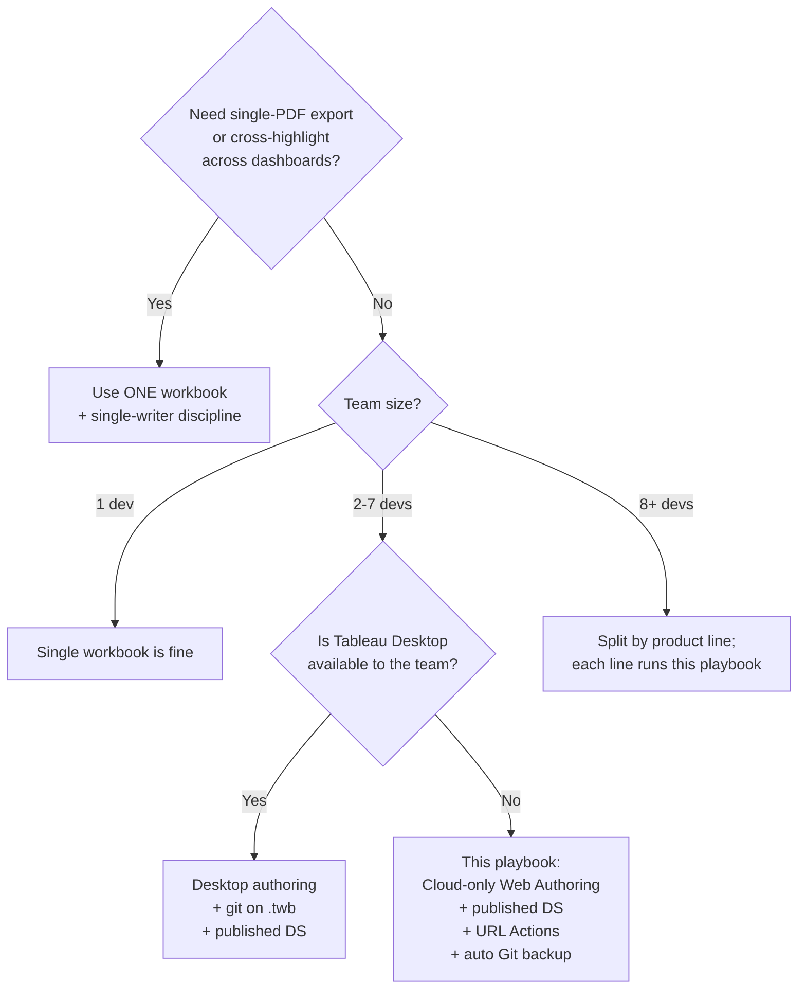

---

## The fundamental constraint

Tableau has **no concurrent editing**. A workbook is a single monolithic XML blob (`.twb`) or zipped archive (`.twbx`). Whoever saves last wins — always. Tableau Cloud's Web Authoring is no different: it's still last-write-wins. Revision history lets you *restore* a prior version; it never *merges* two in-flight edits.

Any collaboration approach that asks two or more developers to edit the same workbook simultaneously will produce lost work. The entire playbook below is engineered around this single fact.

---

## What changes when you're Cloud-only

**Web Authoring can do almost everything:**

- Create and edit sheets, dashboards, stories
- All calculated fields — including FIXED / INCLUDE / EXCLUDE LODs, RANK, RUNNING_SUM, WINDOW_*
- Table calculations with full Compute Using / addressing control
- Parameters, filters, dashboard actions, **URL Actions**
- Dual axis, reference lines, formatting, every mark type
- **Copy Sheet between workbooks** on the same site (since 2022.x)
- Connect to existing published data sources

**Web Authoring cannot easily do:**

- Publish a brand-new data source from a local file (see Part 3 for three workarounds)
- XML-level surgery on `.twb` (no local file to edit — use the Python SDK instead, see Part 7)
- A few niche formatting options that rarely block delivery

**Implication:** work is authored in the browser, lives on Cloud, backed up to Git via API. Nobody emails `.twbx` files.

---

## Core architecture

Six pieces, each solving a specific failure mode:

| Piece | Failure mode it prevents |
|---|---|
| Cloud project structure (Dev/Staging/Prod) | "A dev saved a broken sheet and now execs see it" |
| One published data source | "Three workbooks show three different 'active customer' numbers" |
| Modular decomposition — one workbook per dev | "A and B overwrote each other's save" |
| Navigation hub workbook | "Users get lost across 7 disconnected workbooks" |
| Git as backup/audit layer | "Cloud only keeps 25 revisions — we need blame history" |
| MCP + Python SDK validation | "We published bad content because nobody checked" |

---

## Part 1 — Cloud project governance (Dev/Staging/Prod)

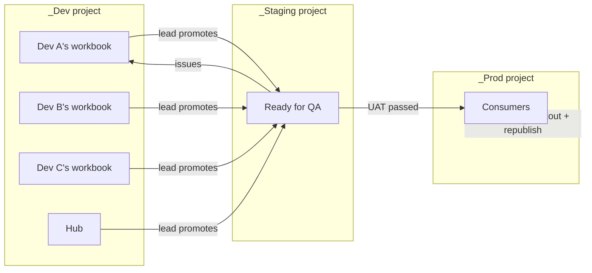

### Three projects, three stages

| Project | Purpose | Who publishes | Who views |
|---|---|---|---|
| `Dashboard_Dev` | Active development | Dev group | Dev group only |
| `Dashboard_Staging` | Lead promotes for QA | Lead only | Dev group + stakeholders |
| `Dashboard_Prod` | Final consumption | Service account via `promote.py` | All viewers/stakeholders |

**Discipline:** consumers only see `_Prod`. Devs never publish directly to `_Prod`. Promotion is a deliberate script-triggered step.

### Permission groups

- `dashboard_developers` — publish to `_Dev`, view-only on `_Staging`/`_Prod`
- `dashboard_reviewers` — view on `_Staging`/`_Prod`, no publish
- `dashboard_viewers` — view `_Prod` only

### Service account for automation

One non-human PAT for the backup script and `promote.py`. Never CI-automate with a human's PAT — humans leave; service accounts don't.

---

## Part 2 — Decomposing the dashboard

Goal: split so **no two developers ever edit the same workbook**. Single highest-leverage decision.

### Split axes (in order of preference)

1. **Business domain / stakeholder audience** — Finance vs Operations vs Customer. Low cross-module data dependencies.
2. **User journey step** — Acquisition → Engagement → Retention → Revenue. URL Actions mirror the user flow.
3. **Data source / domain model** — if one module hits HR data and another hits sales data, they're already separate concerns.
4. **Complexity / compute cost** — heavy computations grouped so performance tuning doesn't slow simpler modules.

### Module ownership table (template)

| Module | Workbook | Owner | Scope |
|---|---|---|---|
| Executive Overview | `exec_overview.twb` | Lead | KPI tiles + headline trends |
| Domain A | `module_a.twb` | Dev A | Detail for domain A |
| Domain B | `module_b.twb` | Dev B | Detail for domain B |
| Domain C | `module_c.twb` | Dev C | Detail for domain C |
| Navigation Hub | `hub.twb` | Lead | Landing page only; links to modules |

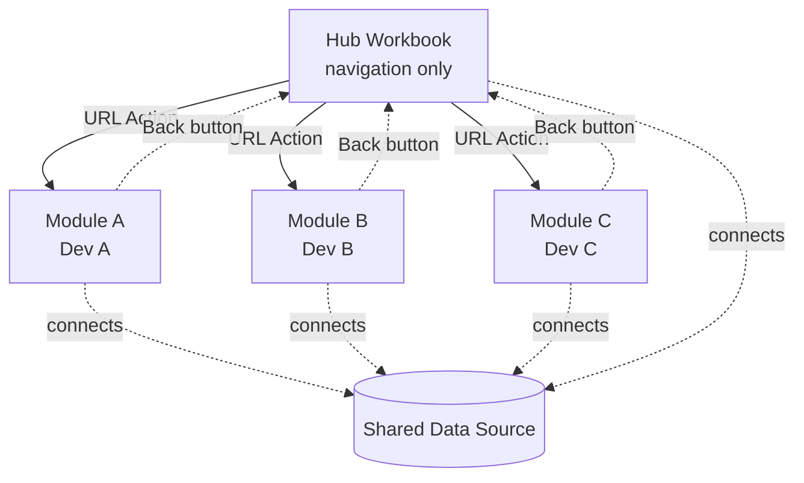

**Rule:** a dev only edits their own workbook. Requests for cross-module changes go through Slack/Linear to the owner.

### Scaling ceiling

This pattern works cleanly for ~5–7 devs. At 8+, the hub becomes the lead's full-time job. Scale by splitting into product lines, each with its own hub + team of 3–5.

---

## Part 3 — Published data source as single source of truth

Every calculated field you define inside a workbook is a fork. Five workbooks with `[Active Customer]` defined locally = five subtly different business definitions, and stakeholders will find the disagreement. Solve it once:

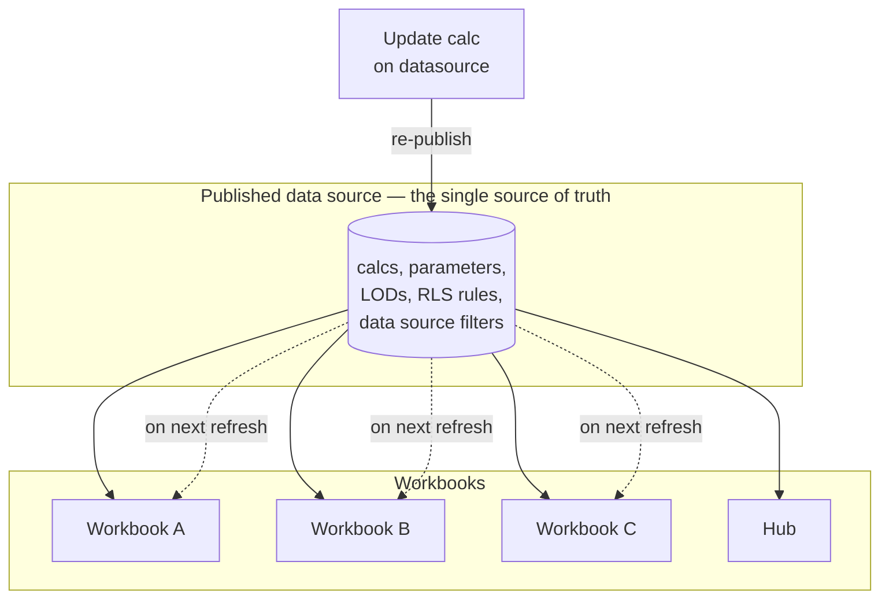

### What goes on the published data source

- Shared calculated fields
- FIXED LODs (cross-workbook by nature)
- Shared parameters
- Row-level security predicates
- Data source filters (purchase-type, date-range, etc.)

### What stays in workbooks

- Viz-specific table calcs (depend on the chart's addressing)
- One-off formatting calcs
- Calculations used in exactly one dashboard

### Publishing the initial datasource without Desktop

Three workarounds to the one genuinely Desktop-dependent step:

1. **Borrow Desktop for one hour.** Publish once, never touch again.
2. **Tableau Prep on Cloud.** Prep flow outputs a datasource; schedule via Prep Conductor (requires Data Management add-on).
3. **REST API from Python** — author `.tds`/`.tdsx` programmatically with `tableaudocumentapi`, publish via `tableauserverclient`. Most complex; fully automatable. Code example in [Part 7](#part-7--python-sdk-toolkit-for-the-team).

### Governance

One owner. Changes go through a PR on the Git-tracked `.tds`, Slack-announced, coordinated re-publish window. After re-publish, devs pick up new calcs via **Data → Refresh** in Web Authoring.

---

## Part 4 — Linking workbooks into one product

Three mechanisms, in order of practicality.

### Mechanism 1 — URL Actions

**Syntax:**

```
https://<cloud-host>/#/site/<site>/views/<target-workbook>/<target-dashboard>?FieldName=<FieldName>
```

- Inside `< >`, use the **literal field caption** with spaces. Do NOT write `<Region%20Name>` — write `<Region Name>`. Tableau substitutes the raw caption with the current selection value, then URL-encodes when it builds the final link.
- Parameters use `Parameters.` prefix: `?Parameters.DateRange=<Parameters.DateRange>`
- Filters use the raw caption: `?Region Name=<Region Name>`

**Hard limitations you must accept:**

- Multi-select filters with comma/ampersand/non-ASCII values break silently
- Date-range filters need `?Field.min=YYYY-MM-DD&Field.max=YYYY-MM-DD`
- Cross-highlight across workbooks is impossible
- Clicking causes a visible browser page reload (not instant in-page drill-through)

### Mechanism 2 — Web Page object (embed)

Drag a Web Page object; point at another dashboard's Cloud URL. Good for side-by-side panels; bad at interactivity (selections don't propagate outward).

### Mechanism 3 — Dashboard Extensions (custom JS)

Write an extension that relays filter state through a backend (WebSocket/Redis/API). Only way to get true cross-workbook filter sync. Reserve for hard requirements.

### What does NOT work across workbooks

| Requirement | Works? |
|---|---|
| Native dashboard actions (filter, highlight) | No — same-workbook only |
| Set actions | No |
| Parameter actions that propagate | No |
| Single PDF export of the full dashboard | No |
| Cross-workbook subscriptions | No |
| Instant cross-filter without a click | No |

If any of the above is a hard requirement: stop splitting, use one workbook + single-writer discipline. No workaround.

### The navigation hub pattern

Hub workbook is dedicated and minimal:
- One landing dashboard
- One sheet per module, formatted as a clickable tile
- One URL Action per tile, targeting the module's main dashboard on Cloud
- A small "Back to Home" button sheet each module embeds, with a URL Action back to the hub

The hub **does not** Copy-Sheet from modules. Pure navigation. Zero assembly cost.

---

## Part 5 — Cloud-only workflow end to end

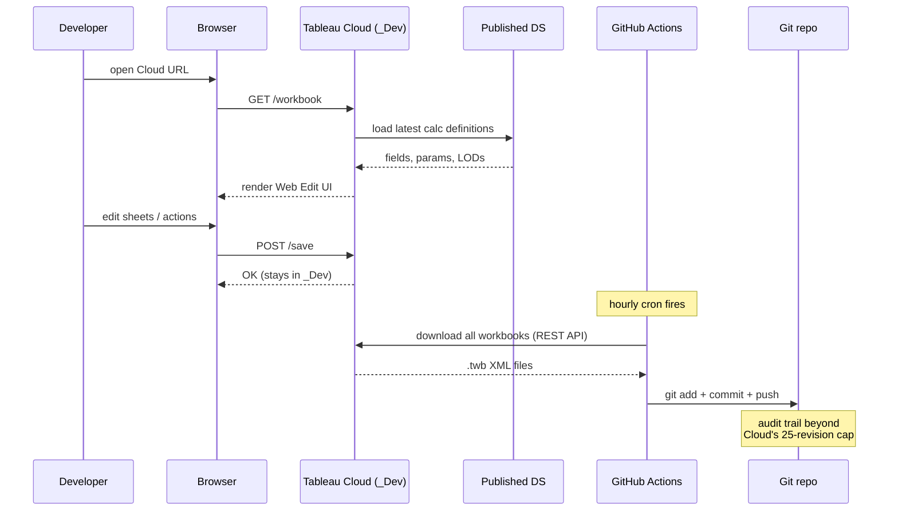

### Daily developer flow

1. Open browser → Cloud → `Dashboard_Dev` project → workbook → **Edit**
2. Build/modify in Web Authoring
3. Save (stays in `_Dev`)
4. Slack: "module A updated, ready for review"
5. Done. No local files, no `git push`, no merge conflicts.

### Automated Git backup

A scheduled job downloads every workbook and datasource from `_Dev`, `_Staging`, `_Prod` once an hour, commits XML to Git. Survives beyond the 25-revision cap; gives you `git blame`.

### Promotion workflow

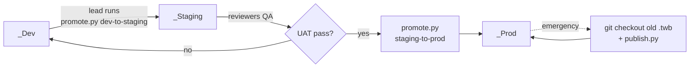

---

## Part 6 — Production-grade automation scripts

### `scripts/backup_tableau_to_git.py`

```python
#!/usr/bin/env python3
"""Pull all workbooks + datasources from Cloud, commit diffs to Git."""
from __future__ import annotations
import os, subprocess, sys
from datetime import datetime, timezone
from pathlib import Path
import tableauserverclient as TSC


PROJECTS = ("Dashboard_Dev", "Dashboard_Staging", "Dashboard_Prod")


def run(cmd: list[str]) -> subprocess.CompletedProcess:
    return subprocess.run(cmd, capture_output=True, text=True, check=False)


def env(name: str) -> str:
    v = os.environ.get(name)
    if not v:
        sys.exit(f"Missing env var: {name}")
    return v


def main() -> int:
    server = TSC.Server(env("TABLEAU_SERVER"), use_server_version=True)
    auth = TSC.PersonalAccessTokenAuth(
        env("TABLEAU_PAT_NAME"), env("TABLEAU_PAT_VALUE"),
        site_id=env("TABLEAU_SITE"),
    )
    repo = Path(__file__).resolve().parent.parent
    wb_dir, ds_dir = repo / "workbooks/src", repo / "data_sources"
    wb_dir.mkdir(parents=True, exist_ok=True)
    ds_dir.mkdir(parents=True, exist_ok=True)

    with server.auth.sign_in(auth):
        for wb in TSC.Pager(server.workbooks):
            if wb.project_name not in PROJECTS:
                continue
            # TSC.download() preserves the server's filename + extension, so
            # capture the returned path and rename to our naming convention.
            downloaded = server.workbooks.download(
                wb.id, filepath=str(wb_dir), include_extract=False,
            )
            final = wb_dir / f"{wb.project_name}__{wb.name}{Path(downloaded).suffix}"
            Path(downloaded).replace(final)
            print(f"wb: {final.relative_to(repo)}")

        for ds in TSC.Pager(server.datasources):
            if ds.project_name not in PROJECTS:
                continue
            downloaded = server.datasources.download(
                ds.id, filepath=str(ds_dir), include_extract=False,
            )
            final = ds_dir / f"{ds.project_name}__{ds.name}{Path(downloaded).suffix}"
            Path(downloaded).replace(final)
            print(f"ds: {final.relative_to(repo)}")

    if run(["git", "-C", str(repo), "diff", "--quiet",
            "workbooks/src/", "data_sources/"]).returncode == 0:
        print("no changes")
        return 0

    ts = datetime.now(timezone.utc).isoformat(timespec="seconds")
    run(["git", "-C", str(repo), "add", "workbooks/src/", "data_sources/"])
    if run(["git", "-C", str(repo), "commit",
            "-m", f"tableau cloud backup {ts}"]).returncode != 0:
        return 1
    return 0 if run(["git", "-C", str(repo), "push"]).returncode == 0 else 1


if __name__ == "__main__":
    sys.exit(main())
```

### `scripts/promote.py`

```python
#!/usr/bin/env python3
"""Promote a workbook Dev -> Staging -> Prod."""
from __future__ import annotations
import argparse, os, sys, tempfile
from pathlib import Path
import tableauserverclient as TSC

STAGES = {
    "dev-to-staging":  ("Dashboard_Dev",     "Dashboard_Staging"),
    "staging-to-prod": ("Dashboard_Staging", "Dashboard_Prod"),
}


def env(name: str) -> str:
    v = os.environ.get(name)
    if not v:
        sys.exit(f"Missing env var: {name}")
    return v


def find_project(server, name):
    matches = [p for p in TSC.Pager(server.projects) if p.name == name]
    if not matches:
        sys.exit(f"Project '{name}' not found")
    return matches[0]


def find_workbook(server, project_id, wb_name):
    for wb in TSC.Pager(server.workbooks):
        if wb.project_id == project_id and wb.name == wb_name:
            return wb
    sys.exit(f"Workbook '{wb_name}' not found")


def main() -> int:
    ap = argparse.ArgumentParser()
    ap.add_argument("stage", choices=list(STAGES))
    ap.add_argument("--workbook", required=True)
    args = ap.parse_args()

    src, tgt = STAGES[args.stage]
    server = TSC.Server(env("TABLEAU_SERVER"), use_server_version=True)
    auth = TSC.PersonalAccessTokenAuth(
        env("TABLEAU_PAT_NAME"), env("TABLEAU_PAT_VALUE"),
        site_id=env("TABLEAU_SITE"),
    )

    with server.auth.sign_in(auth):
        src_proj = find_project(server, src)
        tgt_proj = find_project(server, tgt)
        src_wb = find_workbook(server, src_proj.id, args.workbook)

        with tempfile.TemporaryDirectory() as td:
            # Capture the real downloaded path — TSC preserves the server's
            # filename + extension, which may not match what we'd guess.
            downloaded = server.workbooks.download(
                src_wb.id, filepath=td, include_extract=False,
            )
            new_wb = TSC.WorkbookItem(project_id=tgt_proj.id, name=args.workbook)
            try:
                out = server.workbooks.publish(
                    new_wb, downloaded,
                    mode=TSC.Server.PublishMode.Overwrite,
                )
                print(f"{args.workbook}: {src} -> {tgt} (id {out.id})")
            except TSC.ServerResponseError as e:
                print(f"publish failed: {e.code} {e.summary}", file=sys.stderr)
                return 1
    return 0


if __name__ == "__main__":
    sys.exit(main())
```

### GitHub Actions — hourly backup

`.github/workflows/tableau-backup.yml`:

```yaml
name: Tableau Cloud backup to Git
on:
  schedule: [{cron: "0 * * * *"}]
  workflow_dispatch: {}
jobs:
  backup:
    runs-on: ubuntu-latest
    permissions: {contents: write}
    steps:
      - uses: actions/checkout@v4
        with: {token: "${{ secrets.GH_PAT_FOR_COMMIT }}"}
      - uses: actions/setup-python@v5
        with: {python-version: "3.11"}
      - run: pip install tableauserverclient
      - run: |
          git config user.name  "tableau-backup-bot"
          git config user.email "tableau-backup-bot@users.noreply.github.com"
      - env:
          TABLEAU_SERVER:    ${{ secrets.TABLEAU_SERVER }}
          TABLEAU_SITE:      ${{ secrets.TABLEAU_SITE }}
          TABLEAU_PAT_NAME:  ${{ secrets.TABLEAU_PAT_NAME }}
          TABLEAU_PAT_VALUE: ${{ secrets.TABLEAU_PAT_VALUE }}
        run: python scripts/backup_tableau_to_git.py
```

### `.gitignore` additions

```gitignore
workbooks/output/*.twbx
data_sources/*.tdsx
```

---

## Part 7 — Python SDK toolkit for the team

Five Python libraries cover every programmatic Tableau task. Keep these in your team's toolbelt — they replace Desktop for any automation scenario.

| Library | Use case |
|---|---|
| `tableauserverclient` (TSC) | Publish, download, list, permissions, schedules on Cloud/Server |
| `tableaudocumentapi` | Read/write `.twb` and `.tds` XML (inspect calcs, patch connections) |
| `pantab` + `tableauhyperapi` | Create/read `.hyper` extracts for local testing |
| VizQL Data Service (REST) | Query a published datasource without opening Tableau — pure data |
| Metadata API (GraphQL) | Lineage, impact analysis, field usage across workbooks |

Install:

```bash
pip install tableauserverclient tableaudocumentapi tableauhyperapi pantab requests
```

### SDK 1 — `tableauserverclient` (publish, manage, audit)

Used in `backup_tableau_to_git.py` and `promote.py` above. Core patterns you'll reuse:

```python
# List every workbook in a project
with server.auth.sign_in(auth):
    for wb in TSC.Pager(server.workbooks):
        if wb.project_name == "Dashboard_Prod":
            print(wb.name, wb.updated_at, wb.owner_id)

# Trigger a data source refresh
ds = server.datasources.get_by_id("<ds-id>")
job = server.datasources.refresh(ds)
print(f"refresh queued as job {job.id}")

# Read a workbook's permissions
server.workbooks.populate_permissions(wb)
for rule in wb.permissions:
    print(rule.grantee, rule.capabilities)
```

### SDK 2 — `tableaudocumentapi` (XML inspection and surgery)

Lets you read `.twb`/`.tds` files programmatically — no Tableau required. Useful for:
- Auditing which workbooks define which calcs
- Renaming fields across many workbooks at once
- Patching datasource connections (dev DB vs prod DB)
- Generating `.tds` files from Python/Jinja templates

```python
from tableaudocumentapi import Workbook, Datasource

# Inspect calcs in a workbook
wb = Workbook("workbooks/src/Dashboard_Prod__module_a.twb")
for ds in wb.datasources:
    for field in ds.fields.values():
        if field.calculation is not None:
            print(f"{field.name}: {field.calculation}")

# Patch a connection server in a .tds
ds = Datasource.from_file("data_sources/loyalty.tds")
for conn in ds.connections:
    if conn.dbclass == "snowflake":
        conn.server = "analytics.snowflakecomputing.com"
ds.save()

# Add a calculated field programmatically.
# `add_calculation` requires the full set of metadata kwargs (not just caption+formula):
ds.add_calculation(
    caption="Active Customer",
    formula='DATEDIFF("day",[Last Activity Date],TODAY()) <= 90',
    datatype="boolean",
    role="dimension",
    type="nominal",
    hidden="false",
)
ds.save()

# Heads up: `tableaudocumentapi` support for NEW calc fields has historically been
# limited and brittle on newer .tds schemas. For anything non-trivial, fall back to
# XML surgery with `xml.etree.ElementTree` or generate the .tds from a Jinja2
# template (see Part 9).
```

### SDK 3 — `tableauhyperapi` + `pantab` (local extracts)

Build `.hyper` extract files from pandas DataFrames. Critical for offline dev:

```python
import pandas as pd
import pantab

df = pd.read_csv("data/raw/test_sample.csv")
pantab.frame_to_hyper(df, "data/extracts/test_sample.hyper", table="Extract")
```

In a Cloud-only workflow, **Web Authoring cannot connect directly to a local `.hyper`.** To use this extract as a prototyping data source, you must either:

- Package the `.hyper` with a `.tds` header into a `.tdsx` bundle and publish it to Cloud as a prototype datasource via `server.datasources.publish(...)`, then connect Web Authoring to it, or
- Use the `.hyper` only for offline data-validation scripts that compare pandas ground truth against VDS queries against the published prototype DS (see Part 9).

If you have occasional Desktop access, a `.hyper` on disk is directly connectable from Desktop for rapid local iteration — but that's outside the pure Cloud-only path.

### SDK 4 — VizQL Data Service (VDS, REST API)

Query a published data source directly — returns JSON rows, no workbook needed. Perfect for "compute the KPI value in Python before building the viz" validation loops. No pip install; it's a REST endpoint hosted by Cloud.

```python
import os, requests

token = "<sign-in token from TSC auth>"
site_id = os.environ["TABLEAU_SITE_LUID"]
ds_luid = "<datasource-luid>"

http = requests.post(
    f"{os.environ['TABLEAU_SERVER']}/api/v1/vizql-data-service/query-datasource",
    headers={
        "X-Tableau-Auth": token,
        "Content-Type": "application/json",
    },
    json={
        "datasource": {"datasourceLuid": ds_luid},
        "query": {
            "fields": [
                {"fieldCaption": "Region"},
                {"fieldCaption": "Revenue", "function": "SUM"},
            ],
            "filters": [
                {"field": {"fieldCaption": "Year"},
                 "filterType": "QUANTITATIVE_NUMERICAL",
                 "min": 2025,
                 "max": 2025},
            ],
        },
    },
    timeout=60,
)
http.raise_for_status()
resp = http.json()
if "error" in resp or "data" not in resp:
    raise RuntimeError(f"VDS returned an error payload: {resp}")
# VDS payload syntax evolves; cross-check against current VDS docs before
# copy-pasting into production.

for row in resp["data"]:
    print(row)
```

Use this to validate calcs: compute expected SUM(Revenue) per region via VDS, then verify the Tableau viz matches.

### SDK 5 — Metadata API (GraphQL)

Answers questions Web Authoring can't: "which workbooks use field `[Active Customer]`?", "what breaks if we rename this field?", "what's downstream of this datasource?"

```python
import requests

query = """
query {
  publishedDatasources(filter: {name: "loyalty"}) {
    name
    projectName
    downstreamWorkbooks { name projectName }
    fields {
      name
      ... on ColumnField {
        upstreamColumns { name table { name } }
      }
      ... on CalculatedField {
        formula
      }
    }
  }
}
"""
# Schema note: `downstreamWorkbooks` lives on the datasource, not on each field.
# `upstreamColumns` is specific to ColumnField; calculated fields have `formula`.
# Use GraphQL inline fragments (`... on <Type>`) to query subtype-specific fields.

resp = requests.post(
    f"{os.environ['TABLEAU_SERVER']}/api/metadata/graphql",
    headers={"X-Tableau-Auth": token, "Content-Type": "application/json"},
    json={"query": query},
).json()
```

---

## Part 8 — MCP: validation, review, verification

**MCP (Model Context Protocol)** lets Claude Code talk to Tableau Cloud directly via a standardized tool interface. This repo already has `@tableau/mcp-server` configured in `.mcp.json`. From a Claude Code session you can ask: *"Verify every URL Action in the hub workbook points to a dashboard that exists in `_Prod`"* — and Claude will use MCP to answer.

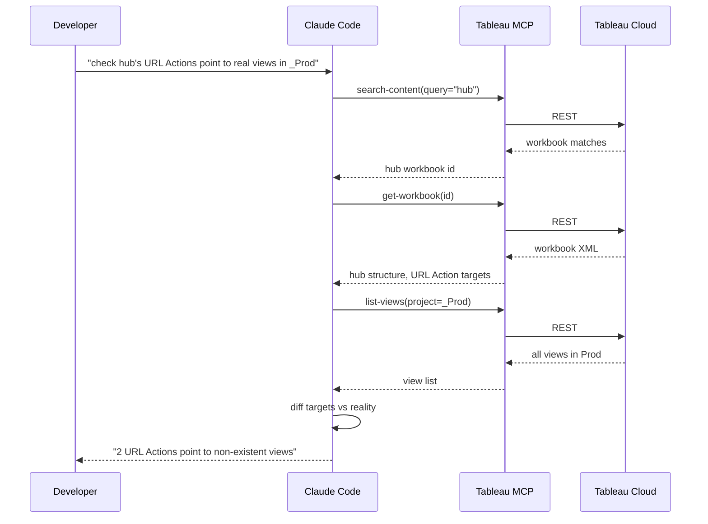

### MCP tools available to Claude Code

From your `.mcp.json` (`@tableau/mcp-server`):

| Tool | What you use it for |
|---|---|
| `list-workbooks` | "Show me everything in `_Staging`" |
| `get-workbook` | Fetch a workbook's metadata/XML for inspection |
| `list-datasources` | "Is the shared datasource published?" |
| `get-datasource-metadata` | List all calcs/fields on a published datasource |
| `query-datasource` | Run a VDS query from conversation — validate numbers |
| `list-views` | "Do all the URL Action targets exist?" |
| `get-view-data` | Pull raw CSV of a view |
| `get-view-image` | Snapshot a view as PNG — visual regression |
| `search-content` | Find anything by keyword |
| `list-all-pulse-metric-definitions` | If you use Pulse alongside |

### Validation workflows MCP enables

**Pre-promotion smoke test.** Before running `promote.py staging-to-prod`, ask Claude Code:
```
Using MCP, for every workbook in Dashboard_Staging: list its views, check
that all URL Actions reference views that exist, and return a per-workbook
pass/fail report.
```

**Post-publish visual check.** After publishing a new module, ask:
```
Use MCP get-view-image on module_a's main dashboard. Compare to last known
good from git (workbooks/src/Dashboard_Prod__module_a.twb). Flag major
visual deltas.
```

**Data reconciliation.** Verify a KPI number in the published datasource:
```
Use MCP query-datasource to compute SUM(Revenue) filtered to 2025, grouped
by Region. Compare to the number shown in the module_a C7 KPI tile by
fetching get-view-data. They should match within rounding.
```

**Impact analysis.** Before renaming a field on the shared datasource:
```
Use MCP list-workbooks + get-workbook to find every workbook referencing
[Active Customer]. List them so we know the blast radius.
```

**Permissions audit.** Before a Prod release:
```
Use MCP list-workbooks on Dashboard_Prod to enumerate workbooks.
Then run `scripts/audit_permissions.py` (using tableauserverclient's
`populate_permissions`) and flag any workbook missing the dashboard_viewers
group.
```
*(The MCP server doesn't currently expose a permissions-listing tool;
use the Python SDK for this step.)*

### When to use MCP vs the Python SDK

| Task | Use MCP (from Claude Code chat) | Use Python SDK directly |
|---|---|---|
| One-off question during dev ("does this exist?") | ✅ | ❌ overkill |
| Ad-hoc data spot-check | ✅ | — |
| Scheduled backup | ❌ | ✅ (cron-friendly) |
| CI/CD pipeline step | ❌ | ✅ (scriptable) |
| Bulk rename across 20 workbooks | — | ✅ (`tableaudocumentapi`) |
| Pre-promotion UAT by a reviewer | ✅ | — |

MCP is the conversational layer. Python SDK is the automation layer. Both hit the same underlying Tableau REST API.

---

## Part 9 — Local development workflow (prototype before Cloud)

Web Authoring is slow on large datasets. For complex calc prototyping, work locally first, then promote the validated definition to the published datasource.

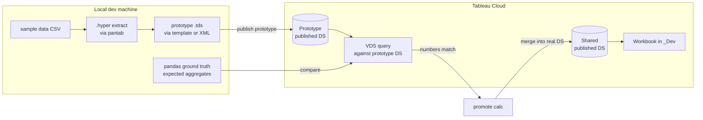

### Prototyping a calc locally

1. Pull a representative data sample via VDS (Python script → CSV)
2. Convert to `.hyper` with `pantab.frame_to_hyper`
3. Compute the target metric in pandas first — that's your ground truth
4. Translate to Tableau calc syntax; save to a prototype `.tds` via `tableaudocumentapi`
5. Query the prototype via VDS; confirm numbers match pandas
6. Only then add the calc to the real published datasource via `tableaudocumentapi` + TSC `datasources.publish(mode=Overwrite)`

This avoids the "spent 3 hours in Web Authoring waiting for 1.5M-row table calcs" loop.

### Generating workbook templates

This repo already has `workbooks/templates/` for Jinja2 → `.twb` generation. Pattern:

```python
from jinja2 import Environment, FileSystemLoader

env = Environment(loader=FileSystemLoader("workbooks/templates"))
tmpl = env.get_template("module_skeleton.twb.j2")

xml = tmpl.render(
    module_name="module_a",
    datasource_name="Loyalty_Prod",
    dashboards=[{"name": "Overview"}, {"name": "Detail"}],
)

Path("workbooks/generated/module_a.twb").write_text(xml)
```

The generated `.twb` can be published to `_Dev` via TSC. This is the cleanest way to stamp out a new module with consistent structure (URL Actions, Back buttons, filter placeholders already wired).

### Data validation harness

Before publishing any module, run a small harness that:
1. Queries VDS for the same numbers the dashboard will show
2. Computes the same numbers independently in pandas from a raw extract
3. Asserts equality within tolerance
4. Fails loudly if they diverge

Example skeleton:

```python
from decimal import Decimal
import pantab, pandas as pd, requests

# 1. Pull raw data
raw = pd.read_csv("data/raw/source_of_truth.csv")

# 2. Compute expected
expected = raw[raw["year"] == 2025].groupby("region")["revenue"].sum()

# 3. Query VDS for the same aggregation
resp = requests.post(VDS_URL, json={...}).json()
actual = {row["Region"]: Decimal(str(row["SUM(Revenue)"])) for row in resp["data"]}

# 4. Assert
for region, expected_val in expected.items():
    assert abs(Decimal(str(expected_val)) - actual[region]) < Decimal("0.01"), \
        f"{region}: expected {expected_val}, got {actual[region]}"
```

Wire this into the promote.py script as a pre-publish check.

---

## Part 10 — AI-assisted creation: formulas, pipelines, visualizations

Claude Code + MCP + the Python SDK together form an agentic loop that drafts, validates, and deploys Tableau artifacts. This does **not** replace Web Authoring for final polish — but it handles ~70% of the tedious middle where humans otherwise repeat themselves: writing calcs, scaffolding workbooks, building data pipelines, reconciling numbers, comparing versions.

### What AI + automation can realistically do end-to-end

| Task | Degree of automation | Where humans remain |
|---|---|---|
| Draft calculated-field formulas from a business description | ~90% | Validate business semantics, approve |
| Scaffold `.twb` skeletons from a spec | ~85% | Polish formatting, tune layout |
| Build ETL pipelines → `.hyper` → publish as datasource | ~80% | Validate business rules against source of truth |
| Numeric reconciliation ("does this tile match the warehouse?") | 100% | Decide tolerance, investigate deltas |
| Visual regression between versions (via `get-view-image`) | ~70% | Judge whether deltas are intentional |
| Suggest viz improvements | ~50% | Apply in Web Authoring (AI can't click UI) |
| Novel interactive experiences | ~0% | Human design + JS Extensions |

### The agentic loop at a glance

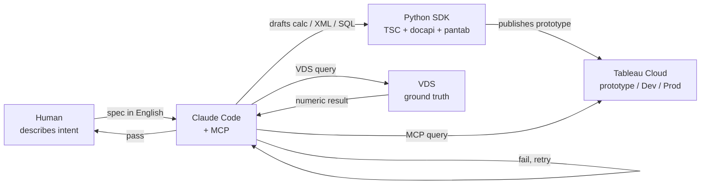

---

### Workflow 1 — Draft, validate, publish a calculated field

The most common use case. Human describes a business rule in English; AI drafts it, validates the numbers, and publishes.

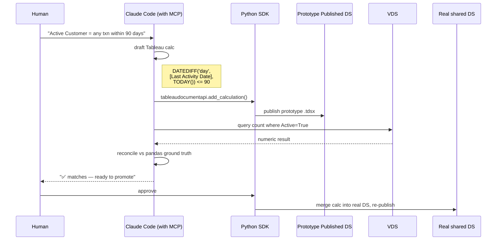

**Human prompt pattern that works well:**
```
Given this business definition: "active customer = any member with a
purchase transaction in the last 90 days, from today's date."

1. Draft the Tableau calc formula (prefer FIXED LOD where applicable)
2. Use MCP query-datasource on the prototype DS to compute how many
   members are Active today
3. Cross-check by querying the source data in pandas
4. If numbers match within 0.5%, propose adding to the shared datasource
```

Claude can execute the whole loop — draft, publish prototype, query, reconcile, propose — because all four capabilities (MCP, VDS, Python SDK, shell) are available in the same session.

---

### Workflow 2 — Scaffold a workbook from a spec

Rather than building each module workbook by hand, define a spec and let Jinja2 + Python generate the `.twb`.

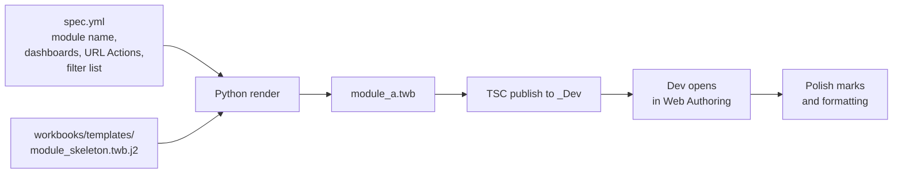

Example spec:

```yaml
# specs/module_a.yml
module_name: module_a
datasource: Loyalty_Prod
dashboards:
  - name: Overview
    filters: [Region, Year]
    url_actions:
      - label: "Back to Home"
        target: hub/Home
  - name: Detail
    filters: [Region, Year, Segment]
```

Rendering:

```python
from jinja2 import Environment, FileSystemLoader
from pathlib import Path
import yaml

env = Environment(loader=FileSystemLoader("workbooks/templates"))
tmpl = env.get_template("module_skeleton.twb.j2")

spec = yaml.safe_load(Path("specs/module_a.yml").read_text())
xml = tmpl.render(**spec)
Path("workbooks/generated/module_a.twb").write_text(xml)
```

The generated `.twb` can be published via `publish.py` to `_Dev`. The developer then opens it in Web Authoring and customizes the actual chart marks, colors, and layout. URL Actions, filter pills, and back buttons are already wired by the template.

**AI's role:** given a new requirement ("we need a dashboard for procurement metrics"), Claude can generate the spec YAML from a conversation, invoke the renderer, and publish the skeleton — often in under a minute.

---

### Workflow 3 — Build a data pipeline (ETL → Hyper → Cloud)

For prototype data or non-production sources, you often need to land data into Cloud as a publishable datasource. This is end-to-end scriptable.

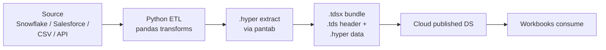

Skeleton script Claude can author from a spec:

```python
import pandas as pd, pantab, zipfile
from pathlib import Path
import tableauserverclient as TSC

# 1. Extract + transform (AI-drafted pandas, reviewed by human)
raw = pd.read_csv("data/raw/procurement.csv")
df = (
    raw.query("amount > 0")
       .assign(amount_after_tax=lambda d: d.amount * (1 - d.tax_rate))
       .groupby(["vendor_id", "month"], as_index=False)
       .agg(total=("amount_after_tax", "sum"),
            orders=("order_id", "nunique"))
)

# 2. Write to .hyper
pantab.frame_to_hyper(df, "data/extracts/procurement.hyper", table="Extract")

# 3. Package into .tdsx (the .tds header references the .hyper by relative path)
with zipfile.ZipFile("data/extracts/procurement.tdsx", "w") as z:
    z.write("data_sources/procurement.tds", arcname="procurement.tds")
    z.write("data/extracts/procurement.hyper",
            arcname="Data/Extracts/procurement.hyper")

# 4. Publish to Cloud
server = TSC.Server(...)
with server.auth.sign_in(...):
    proj = [p for p in TSC.Pager(server.projects) if p.name == "Dashboard_Dev"][0]
    new_ds = TSC.DatasourceItem(project_id=proj.id)
    server.datasources.publish(new_ds, "data/extracts/procurement.tdsx",
                               mode=TSC.Server.PublishMode.Overwrite)
```

**AI's role:** from "we need a vendor spend dashboard, source is this CSV" → draft the pandas transform, propose the aggregation grain, scaffold the tds header, run the publish. Human reviews the business logic, approves, and Claude commits the script.

---

### Workflow 4 — Numeric reconciliation (AI as auditor)

Before promoting a module to Prod, ask Claude to verify that every KPI tile matches the underlying data. Claude has enough tools to do this fully.

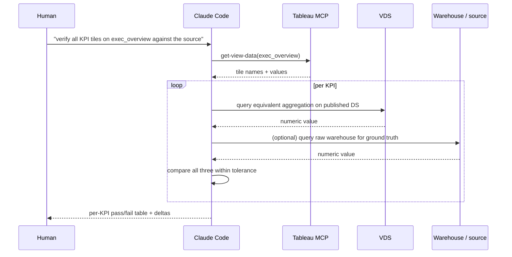

Prompt pattern:

```
Using MCP, list every KPI tile on the exec_overview dashboard in
_Staging (look for sheets of type 'Big Number' or text-only
aggregation). For each tile:
  1. Capture the displayed value via get-view-data
  2. Write a VDS query that computes the same aggregation from the
     shared datasource
  3. Compare, tolerance 0.5%
Output a markdown table: tile, displayed, VDS, delta, status.
Fail loudly if any tile has status != PASS.
```

Wire this into the `promote.py` pre-publish gate, so promotion fails automatically on any reconciliation mismatch.

---

### Workflow 5 — Visual regression (before/after)

Part of quality gates. Claude pulls `get-view-image` PNGs for the same dashboard pre- and post-change, and diffs.

```python
from PIL import Image, ImageChops
import io, requests

def fetch_view_image(view_id, token):
    r = requests.get(
        f"{TABLEAU_SERVER}/api/3.24/sites/{SITE_LUID}/views/{view_id}/image",
        headers={"X-Tableau-Auth": token},
        timeout=60,
    )
    r.raise_for_status()
    return Image.open(io.BytesIO(r.content))

before = fetch_view_image(view_id, token_before)
after  = fetch_view_image(view_id, token_after)

diff = ImageChops.difference(before, after)
if diff.getbbox() is not None:
    # there's a visual delta; save side-by-side for human review
    before.save("audit/before.png")
    after.save("audit/after.png")
    diff.save("audit/diff.png")
```

Claude can invoke this directly via MCP `get-view-image` (no bespoke script needed for simple snapshots) and compare the images, flagging non-trivial deltas.

---

### Prompt patterns that work well

| Goal | Prompt skeleton |
|---|---|
| Draft a calc | "Given business definition [text], write a Tableau calc using the most appropriate LOD. Return only the formula." |
| Scaffold a workbook | "Read `specs/<name>.yml`, render `module_skeleton.twb.j2`, publish to `_Dev`. Return the published view URL." |
| Reconcile a tile | "For dashboard `<name>`, use MCP get-view-data for tile `<X>`, then VDS query the same aggregation. Compare with 0.5% tolerance. Output pass/fail." |
| Impact analysis before renaming a field | "Use Metadata API to list every workbook referencing `[Field X]`. Return a blast-radius table." |
| Visual regression | "Fetch get-view-image for `<dashboard>` in `_Staging` and `_Prod`. Save both. Diff them pixel-wise. Flag if bbox of difference is non-empty." |
| Debug a broken URL Action | "Use MCP get-workbook on `<hub>`. Extract every URL Action URL. For each, use MCP list-views to check the target view exists in `_Prod`. Report broken targets." |

### Where AI falls off a cliff (the hard limits)

- **AI cannot click through Web Authoring.** The final layout/formatting pass is human. MCP gets view images but can't move a mark.
- **AI-generated calcs for new schemas can reference non-existent fields.** Validation via VDS catches this before publish — do not skip the validation step.
- **AI cannot judge aesthetic quality.** It can flag obvious issues (misaligned text, truncated labels) but can't decide "is this chart the right choice for this audience?"
- **Novel interactive experiences still require JavaScript extensions.** Anything requiring custom interaction logic is outside this loop.
- **Business semantics always need human sign-off.** A syntactically valid calc that encodes the wrong business rule is worse than no calc at all.

### Practical adoption — the AI-assisted lead's weekly rhythm

- **Monday:** review the queue of requested calcs/dashboards; Claude drafts specs + calcs; human reviewer approves
- **Tuesday:** Claude runs Workflow 2 + 3 to scaffold new modules; devs open them in Web Authoring for polish
- **Wednesday–Thursday:** devs iterate; Claude handles reconciliation checks on demand ("does the new revenue tile match?")
- **Friday pre-promote:** Claude runs Workflow 4 + 5 as automated quality gates; lead approves promotion

This pattern scales one lead to oversee 3–5 parallel dashboard streams without becoming the bottleneck.

---

## Part 11 — If you have Tableau Desktop available

Desktop is not required for this playbook — Web Authoring covers ~95% of what a team needs. But if your team *does* have Desktop licenses, use them alongside the Cloud-only flow, not instead of it. Everything above still applies: same Dev/Staging/Prod projects, same published datasource, same one-workbook-per-dev rule, same hub + URL Actions, same Git backup.

### What Desktop adds on top of Web Authoring

| Capability | Desktop | Web Authoring | Python SDK |
|---|---|---|---|
| Publish a brand-new data source from scratch | One menu click | Not possible | Possible via REST but fiddly |
| Iterate on complex calcs | Fast — local compute | Slow — every tweak round-trips to Cloud | Good for prototyping, not final polish |
| Open committed `.twb` from Git | Double-click | Not possible | Read-only via `tableaudocumentapi` |
| XML-level debugging | Save As `.twb`, inspect, patch | Not possible | Full access |
| Materialize an extract with calcs baked in | Data → Extract → Compute Now | Limited | Possible via Hyper API |
| Performance Recording (query plan + timings) | Help → Settings → Performance Recording | Not available | n/a |
| Packaging a `.twbx` for offline handoff | File → Export Packaged Workbook | Not available | Possible via XML+zip |

### Where Desktop changes nothing

- Multi-dev collaboration — still last-write-wins. Desktop doesn't unlock concurrent editing.
- Published datasource as source of truth — still required. Desktop just gives a friendlier authoring surface for it.
- Git workflow — same. `.twb` in, `.twb` out.
- Promotion workflow — same. `promote.py` doesn't care which tool authored the workbook.

### The hybrid authoring loop

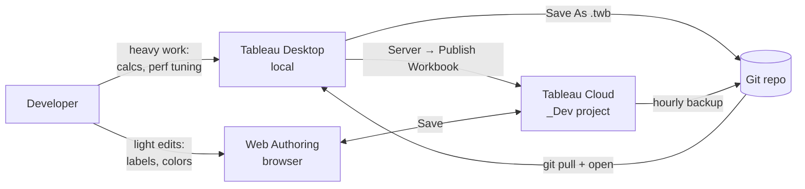

### When to reach for Desktop

- Authoring a new shared datasource with calcs and RLS
- Building out complex nested LODs, table calcs, or parameter actions — Desktop's responsiveness saves hours vs Web Authoring round-trips
- Performance tuning — Desktop shows query plans and per-sheet timings that Web Authoring does not surface
- Debugging "why is this calc slow" — Desktop's profiler is the tool
- Packaging a `.twbx` bundle for an offline stakeholder demo

### When Web Authoring is still right even with Desktop available

- Quick in-meeting edit with a stakeholder watching
- Machine doesn't have Desktop installed (new hire, contractor, traveling)
- Change is a label / color / sort order tweak — not worth the git pull / desktop open / publish cycle
- You want the auto-backup flow to capture the change without manual intervention

### Daily flow when Desktop is in the mix

1. `git pull origin main`
2. Open your module's `.twb` in Desktop (double-click the file)
3. Iterate locally — everything is instant
4. Server → Publish Workbook → `Dashboard_Dev` — your changes land on Cloud
5. (Optional) also `File → Save As .twb` and `git commit` the updated XML
6. Hourly Cloud → Git backup also captures it, so committing manually is a convenience, not a requirement

### Pick one authoring surface per session

Do not have the same workbook open in Desktop AND Web Authoring simultaneously. Last-write-wins applies across both. If you need to switch mid-session, close the other one first and refresh from Cloud / Git.

### Pin the Desktop version

Team must agree on one Desktop build. Newer Desktop writes `.twb` XML that older Desktop cannot open. Record the pinned version in your README. Upgrade as a team — never piecemeal.

### What Desktop does NOT solve

- **Does not remove any dev/staging/prod discipline.** You still publish via `promote.py`, still gate on quality checks.
- **Does not replace the published datasource.** Calcs still belong there, not in workbook-local copies.
- **Does not make 1.65M-row member-grain table calcs fast.** Desktop is fast compared to Web Authoring, but fundamentally large-cardinality compute should be pushed upstream (see performance section).

---

## Part 12 — Quality gates before production

Manual checklist (lead or reviewer runs before `promote.py staging-to-prod`):

- [ ] All dashboards render within the latency budget (document threshold, e.g. <5s first paint)
- [ ] Every URL Action in the hub opens the correct module, pre-filtered
- [ ] "Back to Home" works on every module dashboard
- [ ] Three-metric reconciliation with source system
- [ ] View as Viewer-role user → can see all modules, nothing else
- [ ] Mobile/tablet layout acceptable (if stakeholders use those)
- [ ] Screenshot diff vs previous version flagged to stakeholders

### Automated smoke test (optional, valuable at scale)

Python script using TSC + VDS:
- For each workbook in `_Prod`, load every view headlessly via REST API
- Time each view's first render
- Use MCP `query-datasource` to re-compute two KPIs and assert they match `get-view-data`
- Fail the promotion on any anomaly

Wire into GitHub Actions as a pre-promotion job.

---

## Part 13 — Performance at scale

- **Push compute upstream.** Materialize aggregates in the database (views, materialized tables) or data platform (Snowflake dynamic tables, BigQuery scheduled queries, Salesforce Data Cloud Calculated Insights). Tableau should receive pre-aggregated data, not raw rows.
- **Use published extracts, not live connections,** for high-cardinality data that tolerates refresh latency.
- **Keep viz-layer calcs simple.** Deep nested table calcs on million-row grains kill Web Authoring responsiveness. Push to the datasource or upstream.
- **Limit marks per view** to ~5,000 visible; degrades non-linearly past ~10,000.
- **Dashboard action filter scope** — "selected fields" (not "all fields") to avoid cascade chains across dozens of sheets.

---

## Part 14 — Licensing and cost

Indicative list prices (USD/year). Confirm with your Tableau rep.

| Item | Who needs it | Indicative cost |
|---|---|---|
| Creator seat | Anyone publishing | ~$900/user |
| Explorer seat | Editing published content without publishing DS | ~$504/user |
| Viewer seat | Read-only consumers | ~$180/user (100-seat minimum common) |
| Additional Cloud site | Dev/Prod isolation across sites | Separate subscription, not free |
| Advanced Management add-on | CMT, advanced admin | ~$5.5K/user/year |
| Data Management add-on | Prep Conductor, Catalog | ~$5.5K/user/year |

**Baseline for 5-dev team, one site, 100 viewers:** ~$22K/yr before any add-ons.

---

## Part 15 — When this pattern is wrong

Reject the split-workbook + URL-Action pattern when:

- **Single-PDF export is a hard requirement** — impossible across workbooks
- **Cross-highlight (hover on A, highlight B)** is required — same-workbook only
- **Multi-select filters with special chars (`,`, `&`, non-ASCII)** must propagate — URL substitution breaks
- **Team is one developer** — process is pure overhead
- **Viewer licensing is cost-prohibitive** for the audience size

Fall back to: one workbook, single-writer discipline, Slack-coordinated edits, Cloud revision history for undo.

---

## Adoption plan — week 1

**Day 1 — Lead (4h):**
- Site admin creates `_Dev`, `_Staging`, `_Prod` projects + permission groups
- Service account PAT generated; stored in a secrets manager
- Shared datasource published (Desktop borrow / Prep / REST API)
- `backup_tableau_to_git.py` + GitHub Actions workflow live
- `.mcp.json` configured so the team can use Claude Code for validation

**Day 2 — Team kickoff (2h):**
- Walkthrough of module split + ownership
- Every dev does a "hello world" save on their assigned `_Dev` workbook
- Every dev verifies they can connect to the shared datasource

**Days 3–4 — Parallel development:**
- Each dev builds their module in Web Authoring
- Lead builds the Navigation Hub
- Lead promotes first complete module to `_Staging`
- Reviewers test using MCP-assisted checks

**Day 5 — Integration:**
- Lead wires all URL Actions in the hub against `_Staging` URLs
- Full UAT with the checklist + automated smoke test
- Promote to `_Prod`
- Announce to consumers
